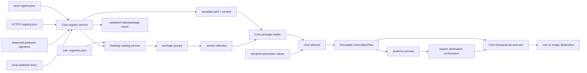

# Architecture

## Implemented boundaries

`Klonker.Core` targets `net10.0` and has no Avalonia reference. It owns
registry-index parsing, local/remote catalog resolution, package integrity,
restricted ZIP extraction, TOML manifest parsing, validation, restricted
Scriban rendering, path safety, immutable generation plans, and transactional
filesystem execution.

`Klonker.Desktop` targets `net10.0`, references Core, and owns Avalonia views,
CommunityToolkit view models, user registry configuration, native folder
selection, and desktop-specific service adapters. Repository sample lookup is
isolated in `DevelopmentSampleRegistryLocator`; no repository path exists in
Core. `RegistryConfigurationStore` owns
`%LOCALAPPDATA%\Klonker\registries.json`; `FavoriteStore` and
`AppSettingsStore` separately own `favorites.json` and `settings.json`.
`ConfiguredTemplateCatalog` passes local/remote sources, publisher trust, and
the cache root into Core.

Desktop uses separate `CatalogView` and `ConfigurationView` user controls.
`MainWindow` owns only custom window chrome and screen hosting. `MainViewModel`
groups resolved templates by registry-qualified family, coordinates the
package -> variant -> configuration navigation, filters, Core planning,
generation confirmation, and structured results without depending on an
Avalonia `Window`. A package group is presentation state only: each selected
variant still carries one independently versioned Core `TemplatePackage`.
`IDestinationPicker` and `IProjectGenerationService` are small testable desktop
boundaries; the Avalonia picker owns native storage UI and the generation
adapter invokes the Core executor.

`ProjectTreeView` is a reusable Desktop control over Avalonia `TreeView`. It
accepts hierarchical `ProjectTreeNodeViewModel` items, exposes two-way file
selection, stores expansion independently on each node, expands directories by
default, and renders host-owned vector icons for folders and known file types.
`GenerationPreviewViewModel` derives that presentation tree deterministically
from `GenerationPlan`; the Core plan remains UI-independent. Preview state
also provides direct file selection, previous/next navigation, and recursive
expand/collapse commands.

`SyntaxHighlightedTextView` is a read-only selectable preview. Its small
host-owned lexer colors C++, Lua, CMake, Markdown, and common configuration
syntax without evaluating input, loading extensions, or executing generated
code.
Template logos are normalized and validated in Core, then decoded to a bounded
card image by Desktop. Manifest tags are presentation metadata; favorites
are keyed by registry/template identity only in app-local state. Custom tags
are kept separate from target,
language, variant, and build metadata; the catalog collects their union for a
dedicated filter and assigns each tag a stable color. Host-owned vector marks
identify the known Windows/Linux platforms and CMake/GNU Make/xmake build
systems without loading icon code or executable assets from a registry.
Package cards similarly render host-owned C++/Lua language marks. An explicit
`build_system = "none"` omits build-system presentation while keeping the
variant independently selectable and filterable.

Files without the `.sbn` suffix remain byte-for-byte payloads in Core. Desktop
may strictly decode a copied file with a known source/configuration extension
as UTF-8 for read-only preview. Invalid UTF-8 and unknown extensions retain the
binary-preview message; this presentation behavior does not change generated
bytes.

`Klonker.Core.Tests` references both production projects. It tests Core
behavior and view models without creating native windows.

Registry version 1 requires SHA-256 and size for every package. Core qualifies
template identity as `<registry-id>:<template-id>@<version>`. Local editable
packages use a canonical directory digest. Remote packages are HTTPS ZIP
artifacts verified before extraction. Sources that require publisher trust
download a bounded detached signature, verify the exact index bytes against a
locally pinned active RSA key, and only then parse/cache the index. Trust can
carry multiple active keys during rotation and revoked keys remain rejected.
Cache directories use SHA-256-derived opaque keys rather than
registry-controlled names.

The dependency direction is Desktop -> Core. Core remains reusable by a future
CLI.

## Core generation pipeline

1. Read and validate `template.toml`.
2. enumerate payload entries without following reparse points;
3. apply defaults and validate declared values;
4. render each path segment and `.sbn` UTF-8 text in a restricted context;
5. normalize paths, detect case-insensitive duplicates and file/directory
   collisions;
6. sort files and directories deterministically;
7. return an immutable in-memory plan without writing output.

The executor accepts a plan, validates paths again, writes all content into a
sibling staging directory, and renames staging into place. A non-empty
destination is rejected and existing files are never overwritten.

## Domain concepts

- **Registry entry:** catalog metadata plus a package path.
- **Registry source:** configured local index path or remote HTTPS index URL.
- **Registry-qualified identity:** registry ID, template ID, and version.
- **Package cache:** verified index/archive/extraction data under opaque keys.
- **Template package:** one independently versioned family/variant directory.
- **Manifest:** identity, language/presentation/target metadata, license, and
  declared parameters.
- **Resolved parameters:** typed primitive values after defaults and
  validation.
- **Generation plan:** template identity, ordered directories/files, immutable
  bytes, optional rendered text, and messages.
- **Validation issue:** severity, stable code, readable message, and optional
  parameter/path context.

## Invariants

- Core never loads Avalonia or repository sample locations.
- Planning never writes.
- Rendering has no external capabilities or nondeterministic inputs.
- All output is relative and Windows-safe, with containment checked again at
  filesystem resolution.
- Destination comparisons are Windows case-insensitive.
- Version zero never follows symbolic links/reparse points or runs processes.
- Generation is all-or-nothing at the final destination boundary.
- A remote index is cached only after schema validation.
- A signature-required remote index is cached only after publisher
  verification with a non-revoked local key.
- A remote package is extracted only after exact size and SHA-256 validation.
- Offline mode performs no HTTP requests.
- ZIP extraction repeats path normalization and containment checks and rejects
  links, collisions, and expansion limits.

Desktop's settings window owns registry editing, appearance, opt-in
diagnostics, prerequisite-probe consent, and narrowly scoped local-data reset
actions. `WindowsPrerequisiteProbeService` recognizes only host-owned probe
IDs, inspects PATH/known folders after an explicit click, and never launches a
process or installs software.

## Planned architecture

WSL destinations and optional modules are planned. Registry-qualified identity
permits multiple sources without silently merging colliding template IDs.
