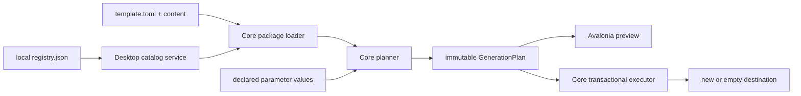

# Architecture

## Implemented boundaries

`Klonker.Core` targets `net10.0` and has no Avalonia reference. It owns local
registry-index reading, TOML manifest parsing, validation, restricted Scriban
rendering, path safety, immutable generation plans, and transactional
filesystem execution.

`Klonker.Desktop` targets `net10.0`, references Core, and owns Avalonia views,
CommunityToolkit view models, and development sample discovery. Repository
sample lookup is isolated in `DevelopmentSampleRegistryLocator`; no repository
path exists in Core.

`Klonker.Core.Tests` references both production projects. It tests Core
behavior and view models without creating native windows.

The dependency direction is Desktop -> Core. Core remains reusable by a future
CLI.

## Core generation pipeline

1. Read and validate `template.toml`.
2. enumerate payload entries without following reparse points;
3. apply defaults and validate declared values;
4. render each path segment and `.sbn` UTF-8 text in a restricted context;
5. normalize paths, detect case-insensitive duplicates and file/directory
   collisions;
6. sort files and directories deterministically;
7. return an immutable in-memory plan without writing output.

The executor accepts a plan, validates paths again, writes all content into a
sibling staging directory, and renames staging into place. A non-empty
destination is rejected and existing files are never overwritten.

## Domain concepts

- **Registry entry:** catalog metadata plus a package path.
- **Template package:** one independently versioned family/variant directory.
- **Manifest:** identity, presentation, target metadata, license, and declared
  parameters.
- **Resolved parameters:** typed primitive values after defaults and
  validation.
- **Generation plan:** template identity, ordered directories/files, immutable
  bytes, optional rendered text, and messages.
- **Validation issue:** severity, stable code, readable message, and optional
  parameter/path context.

## Invariants

- Core never loads Avalonia or repository sample locations.
- Planning never writes.
- Rendering has no external capabilities or nondeterministic inputs.
- All output is relative and Windows-safe, with containment checked again at
  filesystem resolution.
- Destination comparisons are Windows case-insensitive.
- Version zero never follows symbolic links/reparse points or runs processes.
- Generation is all-or-nothing at the final destination boundary.

## Planned architecture

Configured registries, downloads, cache storage, checksums/signatures,
registry-qualified identity, prerequisite probes, WSL destinations, and
optional modules are planned. None is represented as a premature service or
plugin system today. The current single local development registry is not
silently merged with another registry.
